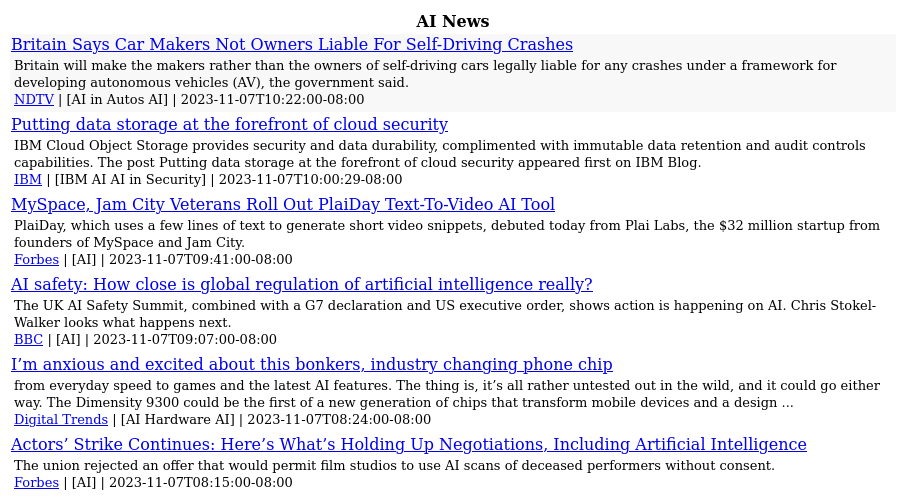

## Task 3  (Async & To be reviewed during stand-ups)

1. Build a simple web server in go. Use your creativity to enhance it.

The webserver retrieves the latest AI News links and displays this info to the user.
An exceprt from the news article, source and timestamp are provided for each article.

